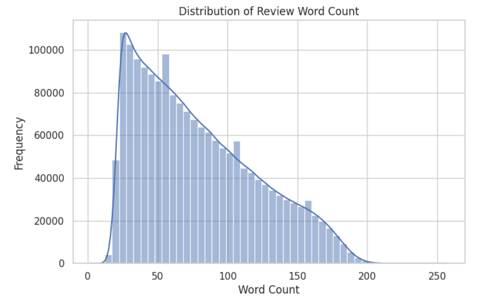
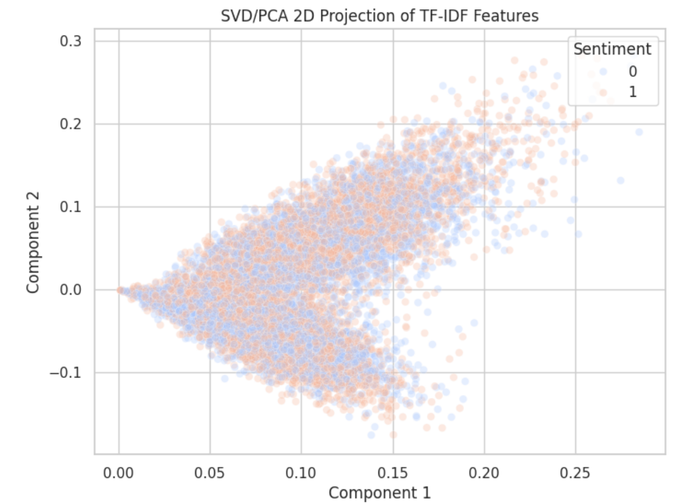
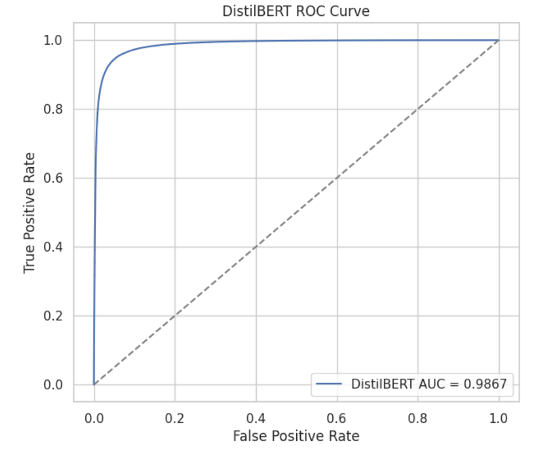

# 🛒 Amazon Reviews Sentiment Analysis
### NLP · Text Classification · Classical ML · DistilBERT · Sentiment Analysis

---

### 🔍 Overview

This project analyzes **Amazon product reviews** and classifies them as **positive or negative** using Natural Language Processing.

It compares traditional machine learning approaches with a transformer-based model, **DistilBERT**, to understand how different NLP methods perform on review sentiment classification.

---

### 🎯 Project Goal

Online reviews contain valuable customer feedback, but reading thousands of reviews manually is not practical.

This project uses NLP to automatically identify review sentiment and evaluate model performance using clear metrics and visual analysis.

---

### ✨ What This Project Includes

| Area | Description |
|---|---|
| Text Cleaning | Preprocessed Amazon review text for modeling |
| Exploratory Analysis | Analyzed review length and text distribution |
| TF-IDF Features | Converted review text into numerical features |
| PCA / SVD Projection | Visualized feature separation in 2D |
| Classical ML | Compared traditional machine learning models |
| DistilBERT | Used transformer-based sentiment classification |
| Evaluation | Reviewed performance using ROC-AUC and classification metrics |

---

### 📊 Visual Results

#### Review Word Count Distribution

Shows how long the reviews are after preprocessing. This helps understand text length patterns before training.

  

---

#### TF-IDF Feature Projection

2D PCA/SVD projection of TF-IDF features, showing how sentiment classes overlap in the feature space.

  

---

#### DistilBERT ROC Curve

DistilBERT achieved strong classification performance with an ROC-AUC score of **0.9867**.

  

---

### 🛠️ Tech Stack

| Category | Tools / Methods |
|---|---|
| Language | Python |
| Environment | Jupyter Notebook / Google Colab |
| Data Processing | Pandas, NumPy |
| Visualization | Matplotlib, Seaborn |
| Feature Engineering | TF-IDF, SVD / PCA |
| Machine Learning | Scikit-learn |
| Transformer Model | DistilBERT |
| Task | Binary Sentiment Classification |

---

### 🧪 Evaluation Focus

| Metric / Check | Purpose |
|---|---|
| Accuracy | Measures overall classification correctness |
| Precision | Checks how many predicted positives are correct |
| Recall | Checks how many actual positives are captured |
| F1-score | Balances precision and recall |
| ROC-AUC | Measures class separation quality |
| Feature Projection | Helps visualize sentiment overlap |
| Review Length Analysis | Understands dataset characteristics |

---

### 👩‍💻 My Role

I worked on this project as an **NLP and model evaluation contributor**.

My work focused on:

- cleaning and preprocessing Amazon review text
- analyzing review length distribution
- building TF-IDF feature representations
- visualizing feature space using PCA/SVD
- training and comparing sentiment classification models
- evaluating DistilBERT performance using ROC-AUC
- documenting results through plots and metric summaries

---

### ▶️ How to Run

#### Prerequisites

Make sure you have:

- Python installed
- Jupyter Notebook or Google Colab
- Required Python libraries installed

#### Setup Steps

1. Clone the repository. `git clone https://github.com/SHREENITHI-TV/Amazon-Reviews-Sentiment-Analysis.git`

2. Open the notebook. `Amazon_Reviews.ipynb`

3. Install dependencies if needed. `pip install pandas numpy matplotlib seaborn scikit-learn transformers torch`

4. Run the notebook cells in order.

5. Review preprocessing, visualizations, model results, and ROC curve.

---

### 📌 Project Relevance

This project demonstrates practical experience with:

- NLP text preprocessing
- sentiment classification
- feature engineering with TF-IDF
- dimensionality reduction using PCA/SVD
- classical ML model comparison
- transformer-based NLP modeling
- model evaluation and visualization
- metric-driven validation

---

### 🚀 Future Improvements

- Build a simple Streamlit demo

---

#### Built to compare classical NLP and transformer-based sentiment classification on Amazon review data.

